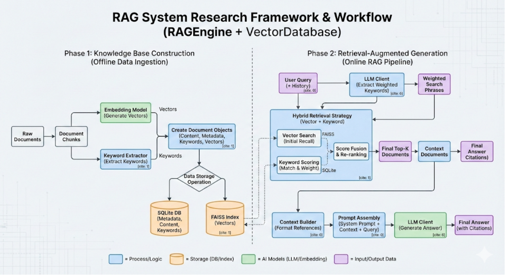

# Sinong Large Language Model
<a href="readme.md">中文</a> ｜ English

**A Vertical Large Model for the General Agricultural Domain**

## Data Collection and Model Training

Relying on the disciplinary features of Nanjing Agricultural University, we have collected large-scale domain data oriented towards specific sub-disciplines such as **Animal Science**, **Animal Medicine**, **Agricultural Economic Management**, **Agricultural Resources and Environment**, **Horticulture**, **Smart Agriculture**, **Plant Protection**, and **Crop Breeding**, with a total volume exceeding 4 billion tokens.

| Data Type | Volume |
| :---- | :---- |
| Books | 8,863 Volumes |
| Papers | 243,897 Articles |
| Policies, Standards, Patents, etc. | 196,748 Documents |
|  |  |

Combining visual models and Large Language Models (LLMs), this multi-source heterogeneous data was organized, screened, and integrated to form a **large-scale**, **high-quality** **agricultural foundation dataset**.

To enhance the model's agricultural language capabilities and domain knowledge, we conducted synthetic data construction, instruction fine-tuning, and reinforcement learning on the foundation dataset. In addition to traditional instruction data, Chain-of-Thought (CoT) and context-reference forms of instruction data were also applied in model training, aiming to improve the model's ability to understand, learn, and use agricultural domain knowledge.

| Data Type | Data Example |
| :---- | :---- |
| QA | "instruction": "In the context of a large population with little land and insufficient reserve arable land resources, how can we draw on the traditional Chinese practice of 'intensive farming' to increase grain yield per unit area while avoiding ecological degradation caused by excessive inputs?","output": "A 'San Cai' (Three Factors) coordinated intensive farming mode should be adopted: First, optimize the cropping system according to local conditions..." |
| COT-QA | "instruction": "What new types of farm tools appeared in Southern paddy field agriculture during the Song Dynasty? How did these tools promote the improvement of rice planting efficiency?",“output”: \<think\>\\nOkay, I need to answer the user's question: 'What new types of farm tools appeared in Southern paddy field agriculture during the Song Dynasty? How did these tools promote the improvement of rice planting efficiency?'...\\n\</think\>\\nThe new types of farm tools that appeared in Southern paddy field agriculture during the Song Dynasty include:..." |
| Incontext-QA | "instruction": ""How do temperature/humidity, cultivation measures, and varietal resistance interact to influence the occurrence of wheat sheath blight, leading to its dynamic development patterns at different growth stages?\\n\\nAfter wheat and barley seeds germinate...",“output”:The occurrence of wheat sheath blight is interactively influenced by temperature/humidity, cultivation measures, and varietal resistance, which jointly determine its dynamic development patterns at different growth stages. Specifically:\\n\\n1. Temperature and humidity dominate disease development rhythm: \\n Pathogen infection and expansion are significantly regulated by temperature. Before winter (below 10°C), disease development is slow, with only sporadic occurrences; when the temperature rises above 15°C the following spring, the disease expands continuously. 20–25°C is the optimal temperature for development, during which the rate of diseased plants and severity rise sharply, peaking especially from the jointing to the booting stage; above 30°C, the disease basically stagnates. Meanwhile, low temperature and rainy weather in spring... |
| Incontext-COT-QA | “instruction”: “What significant characteristics do China's top 100 agricultural foreign investment enterprises exhibit in terms of investment scale, regional distribution, and industrial structure? What priority orientation of China's agricultural 'Going Global' strategy does this reflect?\\n\\nIn 2015, China's top 100 foreign agricultural investment enterprises (hereinafter referred to as 'Top 100 Enterprises') invested 3.061 billion USD abroad, accounting for 84% of the total investment flow; as of the end of 2015, the cumulative investment reached 11.196 billion USD, accounting for 86.6%; 194 agricultural enterprises were established in 58 countries and regions, accounting for 25.4% of the total number of overseas agricultural enterprises; operating income reached 41.838 billion USD, accounting for 94.6% of the operating income of all enterprises. It can be seen that although the proportion of the number of Top 100 Enterprises is not high, in terms of investment scale, operating efficiency, etc....",“output”:"\<think\>\\nOkay, I need to answer the user's question regarding the significant characteristics of China's top 100 agricultural foreign investment enterprises in terms of investment scale, regional distribution, and industrial structure, as well as the priority orientation of the agricultural 'Going Global' strategy reflected by these characteristics. First, I need to carefully read the reference material provided by the user, extract key data from it, and summarize.\\n\\nFirst, looking at the investment scale section. In 2015, the Top 100 Enterprises' foreign...\\n\</think\>\\nThe significant characteristics of China's top 100 agricultural foreign investment enterprises in terms of investment scale, regional distribution, and industrial structure, and the priority orientation of the agricultural 'Going Global' strategy they reflect are as follows:\\n\\n---\\n\\n\#\#\# I. Significant Characteristics\\n1. Concentration of Investment Scale..." |

### Multi-Agent Retrieval-Augmented Generation (RAG)

Currently, Retrieval-Augmented Generation (RAG) has become an indispensable part of domain applications for Large Language Models. However, current RAG for domain-specific professional literature (data papers) still has limitations. We have launched a multi-agent retrieval-augmented framework optimized for knowledge base construction, data sources, and retrieval efficiency.

## Model and Data Usage

### Model Acquisition and Usage

Sinong-1.0 has been open-sourced on the ModelScope community. Currently, we have open-sourced models with two parameter scales: 8B and 32B. Anyone can directly download and deploy these models.
|Model Name|Open Source Address|  
|:---:|:---:|
|Sinong1.0-8B|[ModelScope](https://modelscope.cn/models/NAULLM/Sinong1.0-8B)|
|Sinong1.0-32B|[ModelScope](https://modelscope.cn/models/NAULLM/Sinong1.0-32B)|
||| 

### Data Acquisition and Usage

If you need to use the foundational or process data of this study, please contact us via email (llm4cca@njau.edu.cn). We look forward to exploring the path of smart agriculture under large language models with you.

## Development Team
Sinongwas jointly developed by a cross-university team from Nanjing Agricultural University and Nanjing University of Science and Technology.
* Nanjing Agricultural University: **Wang Dongbo**, Zhao Zhixiao, Liu Ruilin, Yang Fan, Pang Weiqi, Yang Junyi, Li Xuan, Zhou Qian, Wei Qizhi, Wu Ruifeng, Lin Sen, Zhang Hongmin, Pan Mengfei, Lu Qi
* Nanjing University of Science and Technology Team: **Shen Si**, **Zhu Danhao**